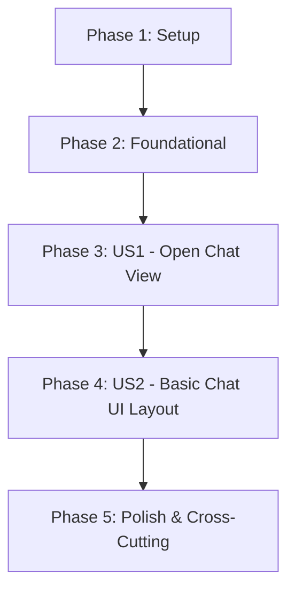

# Tasks: Note Buddy – Initial UI

> **Feature Branch**: 001-assistant-plugin

> **Overview**: Implementation of initial Note Buddy plugin UI (chat sidebar view) without persistence, settings, or LLM integration.

---

## Dependencies and Execution Order

**Parallel Execution Opportunities**:
- **Phase 1**: T002, T003, T004 can run in parallel (independent config files)
- **Phase 4**: T012, T013, T014 can run in parallel (UI components are independent)
- **Phase 5**: T018, T019 can run in parallel (documentation and cleanup)

---

## Phase 1: Setup

**Goal**: Initialize project structure and configuration

- [ ] T001 Create project directory structure: src/, dist/, and .specify/ directories
- [ ] T002 [P] Initialize package: Create package.json with name="note-buddy", version="0.1.0", Obsidian plugin metadata
- [ ] T003 [P] Configure TypeScript: Create tsconfig.json with strict mode, ES2022 target, module resolution
- [ ] T004 [P] Configure build: Create esbuild.config.mjs with entry point src/main.ts, output dist/main.js
- [ ] T005 Initialize Bun: Create bun.lockb and verify Bun package manager is available

---

## Phase 2: Foundational

**Goal**: Establish core plugin infrastructure

- [ ] T006 Create plugin manifest: manifest.json with id="note-buddy", name="Note Buddy", version="0.1.0", minAppVersion="0.15.0"
- [ ] T007 Create main plugin entry: src/main.ts with Plugin class implementing onload/onunload
- [ ] T008 Add ribbon command: Register ribbon icon in onload using Lucide 'bot' icon to open chat view
- [ ] T009 Add chat command registration: Register command in manifest.json to open chat view from command palette

---

## Phase 3: User Story 1 - Open Chat View from Ribbon

**Priority**: P1

**Goal**: User can click a ribbon icon to open/focus the chat sidebar view

**Independent Test Criteria**:
- Plugin enables successfully in Obsidian
- Ribbon icon with bot symbol appears in left ribbon
- Clicking icon opens chat view in right sidebar
- Clicking icon again focuses existing view (no duplicates)
- Command palette command also opens/focuses chat view

**Implementation Tasks**:

- [ ] T010 [US1] Create ChatView class: src/views/ChatView.ts extending ItemView with getViewType()="note-buddy-chat", getDisplayText()="Note Buddy", getIcon()="bot"
- [ ] T011 [US1] Implement view management in plugin: Add ChatView instance tracking, openChatView() method, prevent duplicate views, use workspace.getLeaf('right') for sidebar placement
- [ ] T012 [US1] Connect ribbon icon: Update ribbon command handler in src/main.ts to call plugin.openChatView()
- [ ] T013 [US1] Connect command palette: Update command handler in src/main.ts to call plugin.openChatView()

---

## Phase 4: User Story 2 - Basic Chat UI Layout

**Priority**: P1

**Goal**: Chat view displays header, scroll area, and textarea with send button

**Independent Test Criteria**:
- Chat view renders with header showing "Note Buddy" title
- Scroll area displays below header
- Text input field appears at bottom
- Send button appears next to textarea
- Pressing Enter sends message, Shift+Enter inserts newline
- Console logs message on send
- Toast notification appears on send

**Implementation Tasks**:

- [ ] T014 [US2] Create HTML structure: src/views/ChatView.ts with container div, header h1, scroll-area div, input textarea, send button
- [ ] T015 [P] [US2] Create styles.css: Define layout with flex column, full height, Obsidian CSS variables (--text-accent, --background-primary, --text-normal)
- [ ] T016 [P] [US2] Apply styles to ChatView: Update src/views/ChatView.ts to load styles.css, assign container classes
- [ ] T017 [US2] Implement send handler: Add event listener to send button, log to console, show toast via new Notice(), clear textarea

---

## Phase 5: Polish & Cross-Cutting Concerns

**Goal**: Complete implementation, documentation, and code quality

- [ ] T018 [P] Create README.md: Installation instructions, usage guide, keyboard shortcuts (Enter to send, Shift+Enter for newline)
- [ ] T019 [P] Add inline comments: Document plugin lifecycle, view management, event handlers in src
- [ ] T020 Add JSDoc type annotations: Document ChatView class, methods, and parameters
- [ ] T021 Run TypeScript compiler: Verify no type errors with `bun run tsc --noEmit`
- [ ] T022 Build plugin: Run `bun run build` to generate dist/main.js
- [ ] T023 Verify bundle size: Ensure dist/main.js is reasonable size (<500KB for minimal plugin)

---

## Summary

- **Total Tasks**: 23
- **Setup Phase**: 5 tasks
- **Foundational Phase**: 4 tasks
- **User Story 1 (Open Chat View)**: 4 tasks
- **User Story 2 (Basic Chat UI)**: 4 tasks
- **Polish Phase**: 6 tasks

**Parallel Opportunities Identified**: 3 parallel execution groups
- Group 1: T002, T003, T004 (config files)
- Group 2: T012, T013 (connection tasks)
- Group 3: T018, T019 (documentation tasks)

**MVP Scope**: User Story 1 (Open Chat View) + User Story 2 (Basic Chat UI Layout) = 8 implementation tasks
**Independent Test Criteria**: Each user story has clear verification criteria
**Implementation Strategy**: Incremental delivery - complete US1, verify, then complete US2

---

## Task Format Validation

✅ All tasks follow required checklist format:
- Checkbox: `- [ ]` present on all tasks
- Task ID: Sequential T001-T023
- [P] marker: Applied to parallelizable tasks (T002-T004, T012, T013, T018, T019)
- [Story] label: Applied to user story tasks ([US1] for US1, [US2] for US2)
- Description: Clear action with exact file path
- File paths: All tasks specify exact file locations

---

## Verification Checklist

Before starting implementation, verify:
- [ ] Obsidian development environment is ready
- [ ] Bun package manager is installed
- [ ] TypeScript 5.x is available
- [ ] esbuild is available
- [ ] Lucide icons are available in Obsidian context